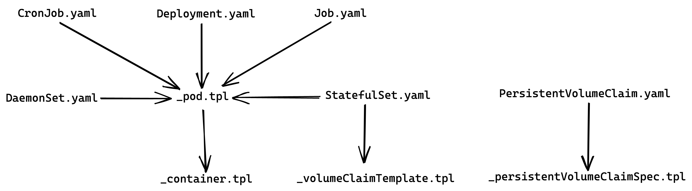

`genesis` is a starter chart for Helm (v3 and above) that provides with usable templates.

## Creating a Chart
​
To create a new chart with `genesis` as the starter chart, `genesis` needs to 
be present in the user's `~/Library/helm/starters/` directory. This is a one time 
setup. To do this, run the following commands:
​

    $ mkdir -p ~/Library/helm/starters/
    $ cp -r genesis/ ~/Library/helm/starters/genesis/

This will setup the starter chart. From now onwards, to create a new chart, run the 
following command:

    $ helm create --starter genesis <chart-name>

All the templates that you might possibly need will be under `<chart-name>/templates` 
directory. Remove the ones that you don't need (look at the diagram to know which ones 
you need while creating any Kubernetes Resource). 
​
```
A -> B -> C -> .. (read: A creates B which in turn creates C and so on..)
```



​​
The `_pod.tpl` and `_container.tpl` files are meant to be included if you want to 
create any Kubernetes Resource that creates Pods (which will in turn create 
containers).
​
> **TL;DR**: 
>   - If you're creating Deployment, CronJob, Job, StatefulSet or DaemonSet include 
`_pod.tpl` and `_container.tpl` in your templates. In case of StatefulSet, do include 
`_volumeClaimTemplate.tpl` too.
>   - If you're creating PVC, do include 
`_persistentVolumeClaimSpec.tpl` and `PersistentVolumeClaim.yaml` in your chart's 
templates.
>   - For all other Resource not mentioned in the diagram, they are standalone 
and do not explicitly depend on anything else.

​
Now we can start populating `values.yaml` file. When done, it's time to see how 
the final templates are rendered and if there are any errors. We can check how 
helm renders the files by running the command:​

    $ helm template <chart-name/>
​
This will only report rendering errors not any syntactical errors. This doesn't validate 
the chart. To check those, run the command:

    $ helm lint --namespace <namespace> <chart-name/>
​
There is another command which does a strict checking on the chart:

    $ helm install --debug --dry-run <path/to/chart-name/>
​
This command simulates an install by connecting to Tiller running on the server but doesn't 
actually install anything.
​
## Installing a chart
​
If you're installing a chart for the first time, you can run the following command:

    helm install --namespace <namespace> <release-name> <path/to/chart/>

> **Chart is installed only once**, and for any new changes the chart is either 
upgraded/rollback(d). If you run `helm install` on the chart multiple times, 
multiple instances will be installed which you probably don't want. **TL;DR**: Don't 
install multiple times unless you know what you're doing.
​
## Upgrading a chart
​
If the chart has been installed and you want to upgrade it, you'll first have to get the 
release name of the installed chart.

    $ helm list --namespace <namespace>

​Once we have the release name, we can run the following:

    $ helm upgrade --namespace <namespace> <release-name> <path/to/updated/chart>
​
> Use `env` section in Deployment spec to store environment variables 
for a Deployment. And for configuration files (to be mounted at runtime), 
keep them in ConfigMap (in `values.yaml` file) as it's checksum is 
used as a field in Deployment (to make sure your pods restart with new configs 
whenever ConfigMap is updated as the checksum computed 
for `.Values.ConfigMap.data` will change which will trigger a restart of 
all the pods in the Deployment). The general idea is only those Kubernetes 
Resources are restarted whose spec have actually changed
​
## Rolling back changes (Degrading to a previous version of the chart)
​
The `REVISION` column in the output of `helm list` gives the info about 
how many times a chart has been `upgraded`. Every time an `upgrade/rollback` 
happens, the REVISION count increases by 1.
​
If you know what revision you have to rollback to, issue the command:
​
    $ helm rollback --namespace <namespace> <release-name> <revision-no>
​
## Deleting a chart
​
If you want to delete a chart, get the release name of the chart and run the following:
​

    $ helm uninstall --namespace <namespace> <release-name>
​

It's possible in some cases and running the delete command won't delete the PVCs 
created. The idea is since PVCs can have shared data that can be used across 
deployments/restarts of the pod. If you're sure you want to still delete the PVC, then
you need to delete them manually.
